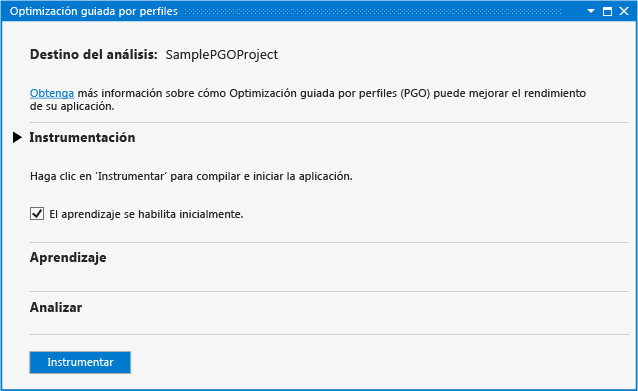
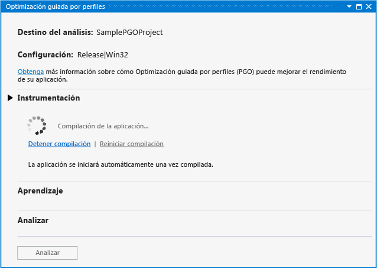
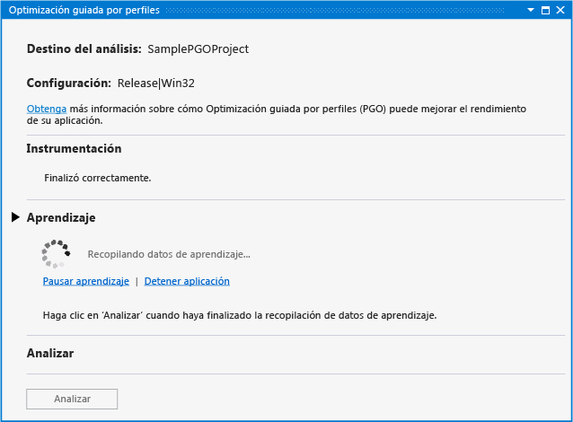
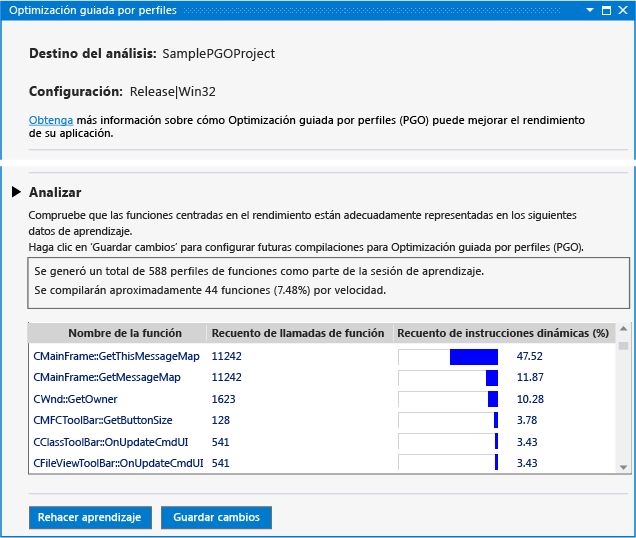
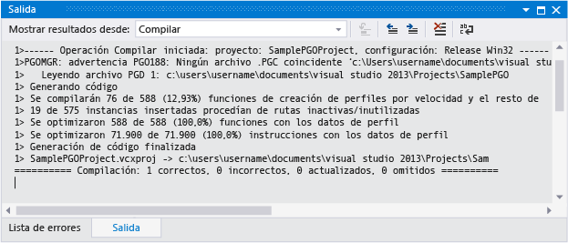

# Optimización guiada por perfiles del concentrador Rendimiento y diagnósticos
El complemento Optimización guiada por perfiles para Visual C++, en el concentrador de rendimiento y diagnósticos, racionaliza la experiencia de optimización guiada por perfiles para desarrolladores. También puede [descargar el complemento](http://go.microsoft.com/fwlink/p/?LinkId=327915) desde el sitio Web de Visual Studio.  
  
 La optimización guiada por perfiles (PGO) ayuda a crear compilaciones de aplicaciones nativas x86 y x64 optimizadas para la forma en que los usuarios interactúan con ellas. PGO es un proceso de varios pasos: el usuario crea una compilación de la aplicación instrumentada para la generación de perfiles y, después, realiza un proceso de “aprendizaje”, es decir, ejecuta la aplicación instrumentada en diversos escenarios comunes de interacción con el usuario. Los datos de generación de perfiles capturados se guardan y después la aplicación se recompila, usando los resultados para orientar la optimización de todo el programa. Si bien estos pasos pueden realizarse individualmente en Visual Studio o en la línea de comandos, el complemento PGO centraliza y simplifica el proceso. El complemento PGO establece todas las opciones necesarias, le guía a través de cada paso, presenta el análisis obtenido y, a continuación, usa los resultados para configurar la compilación de forma que se optimice el tamaño o la velocidad de cada función. Además, dicho complemento facilita volver a ejecutar la formación de la aplicación y actualizar los datos de optimización de la compilación cuando cambia el código.  
  
## Requisitos previos  
 Debe [descargar el complemento PGO](http://go.microsoft.com/fwlink/p/?LinkId=327915) e instalarlo en Visual Studio antes de utilizarla en el Hub rendimiento y diagnósticos.  
  
## Tutorial: usar el complemento PGO para optimizar una aplicación  
 En primer lugar, se creará una aplicación de escritorio de Win32 básica en Visual Studio. Si ya tiene una aplicación nativa que desea optimizar, puede usarla y omitir este paso.  
  
#### Para crear una aplicación  
  
1.  En la barra de menús, elija **Archivo**, **Nuevo**, **Proyecto**.  
  
2.  En el panel izquierdo de la **nuevo proyecto** cuadro de diálogo, expanda **instalado**, **plantillas**, **Visual C++**y, a continuación, seleccione  **MFC**.  
  
3.  En el panel central, seleccione **aplicación MFC**.  
  
4.  Especifique un nombre para el proyecto, por ejemplo, **SamplePGOProject**: en el **nombre** cuadro. Elija el botón **Aceptar** .  
  
5.  En el **Introducción** página de la **Asistente para aplicaciones MFC** diálogo cuadro, elija la **finalizar** botón.  
  
 A continuación, establezca la configuración de compilación de la aplicación en Lanzamiento para prepararla para los pasos de compilación y aprendizaje de PGO.  
  
#### Para establecer la configuración de compilación  
  
1.  En la barra de menús, elija **Compilar**, **Administrador de configuración**.  
  
2.  En el **Configuration Manager** diálogo cuadro, elija la **configuración de soluciones activas** botón de lista desplegable y seleccione **versión**. Elija la **cerrar** botón.  
  
 Abrir Hub rendimiento y diagnósticos, en la barra de menús, elija **analizar**, **rendimiento y diagnósticos**. Esto abre una página de la sesión de diagnósticos con las herramientas de análisis disponibles para el tipo de proyecto.  
  
   
  
 En **herramientas disponibles**, seleccione la **optimización guiada por perfiles** casilla de verificación. Elija la **iniciar** botón para iniciar el complemento PGO.  
  
   
  
 El **optimización guiada por perfiles** página describe los pasos que el complemento utiliza para mejorar el rendimiento de la aplicación. Elija la **iniciar** botón.  
  
   
  
 En el **instrumentación** sección, utilice el **habilitación inicial del entrenamiento** opción para elegir si desea incluir la fase de inicio de la aplicación como parte de la formación. Si no se selecciona esta opción, los datos de aprendizaje no se registran en una aplicación instrumentada en ejecución hasta que no se habilite explícitamente el aprendizaje.  
  
 Elija la **instrumento** botón para compilar la aplicación con un conjunto especial de opciones del compilador. El compilador inserta instrucciones de sondeo en el código generado. Estas instrucciones registran los datos de generación de perfiles durante la fase de aprendizaje.  
  
   
  
 Cuando la compilación instrumentada de la aplicación se completa, la aplicación se inicia automáticamente.  
  
 Si los errores o advertencias se producen durante la compilación, corríjalos y, a continuación, elija **reiniciar compilación** para reiniciar la compilación instrumentada.  
  
 Cuando se inicia la aplicación, puede usar el **iniciar entrenamiento** y **pausar entrenamiento** vincula el **entrenamiento** sección para controlar cuándo se registra la información de generación de perfiles. Puede usar el **detener aplicación** y **Iniciar aplicación** vínculos para detener y reiniciar la aplicación.  
  
   
  
 Durante la formación, recorra los escenarios de usuario para capturar la información de generación de perfiles que el complemento PGO necesita para optimizar el código. Cuando se haya completado el entrenamiento, cierre la aplicación o elija la **detener aplicación** vínculo. Elija la **analizar** botón para iniciar el paso de análisis.  
  
 Una vez completado, el análisis de la **Analysis** sección muestra un informe de la información de generación de perfiles que se capturaron durante la fase de aprendizaje del escenario de usuario. Puede usar este informe para examinar las funciones a las que más llamó la aplicación y a las que dedicó más tiempo. El complemento PGO usa la información para determinar en qué funciones de la aplicación se va a optimizar la velocidad y en cuáles el tamaño. El complemento PGO configura optimizaciones de compilación a fin de crear la aplicación más pequeña y rápida para los escenarios de usuario registrados durante el aprendizaje.  
  
   
  
 Si el entrenamiento capturó la información de generación de perfiles esperada, puede elegir **guardar cambios** para guardar los datos de perfil analizados en el proyecto para optimizar futuras compilaciones. Para descartar los datos de perfil y volver a empezar el entrenamiento desde el principio, elija **rehacer el entrenamiento**.  
  
 El archivo de datos de perfil se guarda en el proyecto en un **datos de entrenamiento de PGO** carpeta. Estos datos se usan para controlar la configuración de optimización de compilación del compilador en la aplicación.  
  
   
  
 Después del análisis, el complemento PGO establece opciones de compilación en el proyecto para usar los datos de perfil para optimizar selectivamente la aplicación durante la compilación. Puede seguir modificando y compilando la aplicación con los mismos datos de perfil. Cuando se compila la aplicación, los resultados de la compilación notifican cuántas funciones e instrucciones se optimizaron usando los datos de perfil.  
  
   
  
 Si realiza cambios de código significativos durante el desarrollo, es posible que tenga que volver a aplicar el entrenamiento a la aplicación para obtener las mejores optimizaciones. Se recomienda volver a aplicar el entrenamiento a la aplicación cuando los resultados de la compilación notifican que menos del 80 % de las funciones o instrucciones se optimizaron usando los datos de perfil.