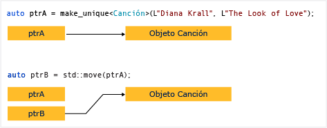

# C&#243;mo: Crear y usar instancias de unique_ptr
[!INCLUDE[vs2017banner](../assembler/inline/includes/vs2017banner.md)]

Un [unique\_ptr](../standard-library/unique-ptr-class.md) no comparte el puntero.  No se puede copiar en otro `unique_ptr`, pasar por valor a una función ni utilizar en ningún algoritmo de la Biblioteca de plantillas estándar \(STL\) que requiera hacer copias.  Un `unique_ptr` solo se puede mover.  Esto significa que la propiedad del recurso de memoria se transfiere a otro `unique_ptr` y el `unique_ptr` original deja de poseerlo.  Se recomienda limitar un objeto a un propietario, porque la propiedad múltiple agrega complejidad a la lógica del programa.  Por consiguiente, si necesita un puntero inteligente para un objeto de C\+\+ sin formato, utilice `unique_ptr`, y cuando construya un `unique_ptr`, utilice la función auxiliar [make\_unique](../Topic/make_unique.md).  
  
 El diagrama siguiente muestra la transferencia de propiedad entre dos instancias de `unique_ptr`.  
  
   
  
 `unique_ptr` se define en el encabezado `<memory>` en la STL.  Es exactamente tan eficaz como un puntero sin formato y puede utilizarse en contenedores STL.  La adición de instancias de `unique_ptr` a los contenedores STL es eficaz porque el constructor de movimiento de `unique_ptr` elimina la necesidad de una operación de copia.  
  
## Ejemplo  
 En el ejemplo siguiente se muestra cómo crear instancias de `unique_ptr` y pasarlas entre funciones.  
  
 [!code-cpp[stl_smart_pointers#210](../cpp/codesnippet/CPP/how-to-create-and-use-unique-ptr-instances_1.cpp)]  
  
 Estos ejemplos muestran esta característica básica de `unique_ptr`: se puede mover, pero no copiar. "Mover" transfiere la propiedad a un nuevo `unique_ptr` y restablece el antiguo `unique_ptr`.  
  
## Ejemplo  
 En el ejemplo siguiente se muestra cómo crear instancias del objeto `unique_ptr` y usarlas en un vector.  
  
 [!code-cpp[stl_smart_pointers#211](../cpp/codesnippet/CPP/how-to-create-and-use-unique-ptr-instances_2.cpp)]  
  
 En el intervalo del bucle, observe que `unique_ptr` se pasa por referencia.  Si intenta pasar el parámetro por valor aquí, el compilador producirá un error porque se elimina el constructor de copias `unique_ptr`.  
  
## Ejemplo  
 En el siguiente ejemplo se muestra cómo se inicializa un `unique_ptr` que es miembro de una clase.  
  
 [!code-cpp[stl_smart_pointers#212](../cpp/codesnippet/CPP/how-to-create-and-use-unique-ptr-instances_3.cpp)]  
  
## Ejemplo  
 Puede utilizar [make\_unique](../Topic/make_unique.md) para crear `unique_ptr` a una matriz, pero no puede utilizar `make_unique` para inicializar los elementos de matriz.  
  
 [!code-cpp[stl_smart_pointers#213](../cpp/codesnippet/CPP/how-to-create-and-use-unique-ptr-instances_4.cpp)]  
  
 Para obtener más ejemplos, vea [make\_unique](../Topic/make_unique.md).  
  
## Vea también  
 [Punteros inteligentes](../cpp/smart-pointers-modern-cpp.md)   
 [make\_unique](../Topic/make_unique.md)