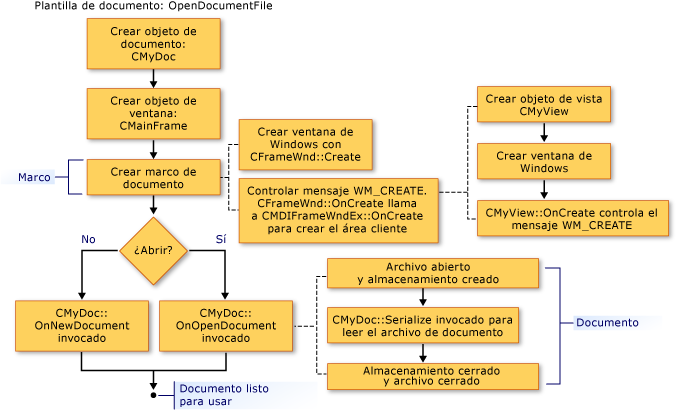

# Crear nuevos documentos, ventanas y vistas
Las ilustraciones siguientes proporcionan información general sobre el proceso de creación de documentos, vistas y ventanas de marco. Otros artículos que se centran en los objetos participantes proporcionan más detalles.  
  
 Tras la finalización de este proceso, los objetos al cooperar existen y almacenan punteros a entre sí. Las ilustraciones siguientes muestran la secuencia en la que se crean los objetos. Puede seguir la secuencia de una ilustración a otra.  
  
   
Secuencia de creación de un documento  
  
   
Secuencia de creación de una ventana de marco  
  
   
Secuencia de creación de una vista  
  
 Para obtener información acerca de cómo el marco de trabajo inicializa el nuevo documento, vista y los objetos de ventana de marco, consulte las clases [CDocument](../mfc/reference/cdocument-class.md), [CView](../mfc/reference/cview-class.md), [CFrameWnd](../mfc/reference/cframewnd-class.md), [CMDIFrameWnd](../mfc/reference/cmdiframewnd-class.md), y [CMDIChildWnd](../mfc/reference/cmdichildwnd-class.md) en la referencia de la biblioteca MFC. Consulte también [Nota técnica 22](../mfc/tn022-standard-commands-implementation.md), que se explican los procesos de creación e inicialización adicional en su explicación de los comandos estándar del marco de trabajo para el `New` y **abiertos** elementos en la **Archivo** menú.  
  
##   Inicializar nuestras propias adiciones a estas clases  
 Las ilustraciones precedentes también sugieren los puntos en el que se pueden reemplazar funciones miembro para inicializar los objetos de la aplicación. Una invalidación de `OnInitialUpdate` en la vista de clase es el mejor lugar para inicializar la vista. El `OnInitialUpdate` se produce la llamada inmediatamente después de que se crea la ventana de marco y la vista en la ventana de marco está conectada a su documento. Por ejemplo, si la vista es una vista de desplazamiento (derivado de `CScrollView` en lugar de `CView`), debe establecer el tamaño de la vista según el tamaño del documento en su `OnInitialUpdate` invalidar. (Este proceso se describe en la descripción de la clase [CScrollView](../mfc/reference/cscrollview-class.md).) Puede invalidar la **CDocument** funciones miembro `OnNewDocument` y `OnOpenDocument` para proporcionar inicialización específica de la aplicación del documento. Por lo general, es necesario reemplazar ambos ya que puede crear un documento de dos maneras.  
  
 En la mayoría de los casos, el reemplazo debe llamar a la versión de la clase base. Para obtener más información, vea las funciones miembro con nombre de las clases [CDocument](../mfc/reference/cdocument-class.md), [CView](../mfc/reference/cview-class.md), [CFrameWnd](../mfc/reference/cframewnd-class.md), y [CWinApp](../mfc/reference/cwinapp-class.md) en MFC Referencia de la biblioteca.  
  
## Vea también  
 [Plantillas de documento y el proceso de creación de documento/vista](../mfc/document-templates-and-the-document-view-creation-process.md)   
 [Creación de la plantilla de documento](../mfc/document-template-creation.md)   
 [Creación de documento/vista](../mfc/document-view-creation.md)   
 [Relaciones entre objetos MFC](../mfc/relationships-among-mfc-objects.md)

