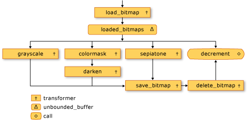
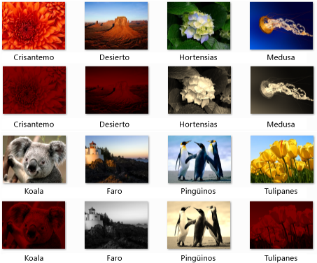

# Tutorial: Crear una red de procesamiento de imagen
[!INCLUDE[vs2017banner](../../assembler/inline/includes/vs2017banner.md)]

En este documento se muestra cómo crear una red de bloques de mensajes asincrónicos que realizan el procesamiento de imágenes.  
  
 La red determina qué operaciones se van a realizar en una imagen según sus características.  En este ejemplo se usa el modelo de *flujo de datos* para enrutar imágenes a través de la red.  En el modelo de flujo de datos, los componentes independientes de un programa se comunican entre sí enviando mensajes.  Cuando un componente recibe un mensaje, puede realizar alguna acción y, a continuación, pasar el resultado de esa acción a otro componente.  Compare esto con el modelo de *flujo de control*, en el que una aplicación usa estructuras de control, como instrucciones condicionales, bucles, etc., para controlar el orden de las operaciones en un programa.  
  
 Una red que se basa en el flujo de datos crea una *canalización* de tareas.  Cada fase de la canalización realiza simultáneamente parte de la tarea global.  Una analogía a esto es una línea de montaje para la fabricación de automóviles.  A medida que cada vehículo pasa a través de la línea de montaje, una estación ensambla el chasis, otra instala el motor, etc.  Al poder ensamblar varios vehículos simultáneamente, la línea de montaje proporciona un mejor rendimiento que si se montaran vehículos completos de uno en uno.  
  
## Requisitos previos  
 Lea los documentos siguientes antes de iniciar este tutorial:  
  
-   [Bloques de mensajes asincrónicos](../../parallel/concrt/asynchronous-message-blocks.md)  
  
-   [Cómo: Utilizar un filtro de bloque de mensaje](../../parallel/concrt/how-to-use-a-message-block-filter.md)  
  
-   [Tutorial: Crear un agente de flujo de datos](../../parallel/concrt/walkthrough-creating-a-dataflow-agent.md)  
  
 También se recomienda que entienda los fundamentos de [!INCLUDE[ndptecgdiplus](../../parallel/concrt/includes/ndptecgdiplus_md.md)] antes de iniciar este tutorial.  Para obtener más información sobre [!INCLUDE[ndptecgdiplus](../../parallel/concrt/includes/ndptecgdiplus_md.md)], vea [GDI\+](_gdiplus_GDI_start_cpp).  
  
##   Secciones  
 Este tutorial contiene las siguientes secciones:  
  
-   [Definir la funcionalidad del procesamiento de imágenes](#functionality)  
  
-   [Crear la red de procesamiento de imágenes](#network)  
  
-   [Ejemplo completo](#complete)  
  
##   Definir la funcionalidad del procesamiento de imágenes  
 En esta sección se muestran las funciones auxiliares que la red de procesamiento de imágenes empela para trabajar con imágenes que se leen desde disco.  
  
 Las siguientes funciones, `GetRGB` y `MakeColor`, extraen y combinan los componentes individuales del color proporcionado, respectivamente.  
  
 [!code-cpp[concrt-image-processing-filter#2](../../parallel/concrt/codesnippet/CPP/walkthrough-creating-an-image-processing-network_1.cpp)]  
  
 La siguiente función, `ProcessImage`, llama al objeto [std::function](../../standard-library/function-class.md) especificado para transformar el valor de color de cada píxel en un objeto [Bitmap](https://msdn.microsoft.com/en-us/library/ms534420.aspx) de [!INCLUDE[ndptecgdiplus](../../parallel/concrt/includes/ndptecgdiplus_md.md)].  La función de `ProcessImage` utiliza el algoritmo de [concurrency::parallel\_for](../Topic/parallel_for%20Function.md) para procesar cada fila del mapa de bits en paralelo.  
  
 [!code-cpp[concrt-image-processing-filter#3](../../parallel/concrt/codesnippet/CPP/walkthrough-creating-an-image-processing-network_2.cpp)]  
  
 Las siguientes funciones, `Grayscale`, `Sepiatone`, `ColorMask` y `Darken`, llaman a la función `ProcessImage` para transformar el valor del color de cada píxel de un objeto `Bitmap`.  Cada una de estas funciones usa una expresión lambda para definir la transformación de color de un píxel.  
  
 [!code-cpp[concrt-image-processing-filter#4](../../parallel/concrt/codesnippet/CPP/walkthrough-creating-an-image-processing-network_3.cpp)]  
  
 La siguiente función, `GetColorDominance`, también llama a la función `ProcessImage`.  Sin embargo, en lugar de cambiar el valor de cada color, esta función utiliza los objetos de [concurrency::combinable](../../parallel/concrt/reference/combinable-class.md) para calcular si el componente de color rojo, verde, o azul domina la imagen.  
  
 [!code-cpp[concrt-image-processing-filter#5](../../parallel/concrt/codesnippet/CPP/walkthrough-creating-an-image-processing-network_4.cpp)]  
  
 La siguiente función, `GetEncoderClsid`, recupera el identificador de clase para el tipo MIME especificado de un codificador.  La aplicación usa esta característica para recuperar el codificador para un mapa de bits.  
  
 [!code-cpp[concrt-image-processing-filter#6](../../parallel/concrt/codesnippet/CPP/walkthrough-creating-an-image-processing-network_5.cpp)]  
  
 \[[Arriba](#top)\]  
  
##   Crear la red de procesamiento de imágenes  
 En esta sección se describe cómo crear una red de bloques de mensajes asincrónicos que realizan el procesamiento de imágenes en cada imagen [!INCLUDE[TLA#tla_jpeg](../../parallel/concrt/includes/tlasharptla_jpeg_md.md)] \(.jpg\) de un directorio determinado.  La red realiza las operaciones siguientes de procesamiento de imágenes:  
  
1.  Para cualquier imagen creada por Tom, la convierte a escala de grises.  
  
2.  Para cualquier imagen que tenga rojo como color dominante, quita los componentes verde y azul y, a continuación, la oscurece.  
  
3.  Para cualquier otra imagen, aplica el tono sepia.  
  
 La red aplica únicamente la primera operación de procesamiento de imágenes que coincide con una de estas condiciones.  Por ejemplo, si una imagen está creada por Tom y tiene rojo como color dominante, la imagen solo se convierte a escala de grises.  
  
 Una vez que la red realiza cada operación de procesamiento de imágenes, guarda la imagen en el disco como un archivo de mapa de bits \(.bmp\).  
  
 En los pasos siguientes se muestra cómo crear una función que implementa esta red de procesamiento de imágenes y aplica esa red a cada imagen [!INCLUDE[TLA#tla_jpeg](../../parallel/concrt/includes/tlasharptla_jpeg_md.md)] de un directorio determinado.  
  
#### Para crear la red de procesamiento de imágenes  
  
1.  Cree una función, `ProcessImages`, que tome el nombre de un directorio del disco.  
  
     [!code-cpp[concrt-image-processing-filter#7](../../parallel/concrt/codesnippet/CPP/walkthrough-creating-an-image-processing-network_6.cpp)]  
  
2.  En la función `ProcessImages`, cree una variable `countdown_event`.  La clase `countdown_event` se muestra más adelante en este tutorial.  
  
     [!code-cpp[concrt-image-processing-filter#8](../../parallel/concrt/codesnippet/CPP/walkthrough-creating-an-image-processing-network_7.cpp)]  
  
3.  Cree un objeto [std::map](../../standard-library/map-class.md) que asocie un objeto `Bitmap` con su nombre de archivo original.  
  
     [!code-cpp[concrt-image-processing-filter#9](../../parallel/concrt/codesnippet/CPP/walkthrough-creating-an-image-processing-network_8.cpp)]  
  
4.  Agregue el código siguiente para definir los miembros de la red de procesamiento de imágenes.  
  
     [!code-cpp[concrt-image-processing-filter#10](../../parallel/concrt/codesnippet/CPP/walkthrough-creating-an-image-processing-network_9.cpp)]  
  
5.  Agregue el código siguiente para conectar la red.  
  
     [!code-cpp[concrt-image-processing-filter#11](../../parallel/concrt/codesnippet/CPP/walkthrough-creating-an-image-processing-network_10.cpp)]  
  
6.  Agregue el código siguiente para enviar al encabezado de la red la ruta de acceso completa de cada archivo [!INCLUDE[TLA#tla_jpeg](../../parallel/concrt/includes/tlasharptla_jpeg_md.md)] del directorio.  
  
     [!code-cpp[concrt-image-processing-filter#12](../../parallel/concrt/codesnippet/CPP/walkthrough-creating-an-image-processing-network_11.cpp)]  
  
7.  Espere hasta que la variable `countdown_event` llegue a cero.  
  
     [!code-cpp[concrt-image-processing-filter#13](../../parallel/concrt/codesnippet/CPP/walkthrough-creating-an-image-processing-network_12.cpp)]  
  
 En la tabla siguiente se describen los miembros de la red.  
  
|Miembro|Descripción|  
|-------------|-----------------|  
|`load_bitmap`|Un objeto de [concurrency::transformer](../../parallel/concrt/reference/transformer-class.md) que carga un objeto de `Bitmap` desde el disco y agrega una entrada al objeto de `map` para asociar la imagen con el nombre de archivo original.|  
|`loaded_bitmaps`|Un objeto de [concurrency::unbounded\_buffer](../Topic/unbounded_buffer%20Class.md) que envía las imágenes cargadas a los filtros de procesamiento de imágenes.|  
|`grayscale`|Un objeto `transformer` que convierte las imágenes creadas por Tom a escala de grises.  Usa los metadatos de la imagen para determinar su autor.|  
|`colormask`|Un objeto `transformer` que quita los componentes de color verde y azul de las imágenes que tienen el rojo como color dominante.|  
|`darken`|Un objeto `transformer` que oscurece las imágenes que tienen el rojo como color dominante.|  
|`sepiatone`|Un objeto `transformer` que aplica el tono sepia a las imágenes que no están creadas por Tom y no son predominantemente rojas.|  
|`save_bitmap`|Un objeto `transformer` que guarda la `image` procesada en el disco como un mapa de bits.  `save_bitmap` recupera el nombre de archivo original del objeto `map` y cambia su extensión de nombre de archivo a .bmp.|  
|`delete_bitmap`|Un objeto `transformer` que libera memoria para las imágenes.|  
|`decrement`|Un objeto de [concurrency::call](../../parallel/concrt/reference/call-class.md) que actúa como nodo terminal de la red.  Disminuye el objeto `countdown_event` para indicar a la aplicación principal que se ha procesado una imagen.|  
  
 El búfer de mensajes `loaded_bitmaps` es importante porque, como un objeto `unbounded_buffer`, ofrece objetos `Bitmap` a varios receptores.  Cuando un bloque de destino acepta un objeto `Bitmap`, el objeto `unbounded_buffer` no ofrece ese objeto `Bitmap` a ningún otro destino.  Por tanto, el orden en que vincula objetos a un objeto `unbounded_buffer` es importante.  Cada uno de los bloques de mensajes `grayscale`, `colormask` y `sepiatone` usa un filtro para aceptar solo ciertos objetos `Bitmap`.  El búfer de mensajes `decrement` es un destino importante del búfer de mensajes `loaded_bitmaps` porque acepta todos los objetos `Bitmap` rechazados por los demás búferes de mensajes.  Se necesita un objeto `unbounded_buffer` para propagar los mensajes en orden.  Por tanto, un objeto `unbounded_buffer` se bloquea hasta que se le vincula un nuevo bloque de destino y acepta el mensaje si ningún bloque de destino actual acepta ese mensaje.  
  
 Si la aplicación necesita que varios bloques de mensajes procesen el mensaje, en lugar de solo el bloque de mensajes que primero acepta el mensaje, puede usar otro tipo de bloque de mensajes, como `overwrite_buffer`.  La clase `overwrite_buffer` contiene un mensaje cada vez, pero propaga ese mensaje a cada uno de sus destinos.  
  
 En la siguiente ilustración se muestra la red de procesamiento de imágenes:  
  
   
  
 El objeto `countdown_event` de este ejemplo permite a la red de procesamiento de imágenes informar a la aplicación principal cuando se han procesado todas las imágenes.  La clase de `countdown_event` usa un objeto de [concurrency::event](../../parallel/concrt/reference/event-class.md) para indicar cuándo un valor de contador llega a cero.  La aplicación principal incrementa el contador cada vez que envía un nombre de archivo a la red.  El nodo terminal de la red disminuye el contador una vez procesada cada imagen.  Después de que la aplicación principal recorre el directorio especificado, espera el objeto `countdown_event` para indicar que su contador ha llegado a cero.  
  
 En el siguiente ejemplo se muestra la clase `countdown_event`:  
  
 [!code-cpp[concrt-image-processing-filter#14](../../parallel/concrt/codesnippet/CPP/walkthrough-creating-an-image-processing-network_13.cpp)]  
  
 \[[Arriba](#top)\]  
  
##   Ejemplo completo  
 En el código siguiente se muestra el ejemplo completo.  La función `wmain` administra la biblioteca de [!INCLUDE[ndptecgdiplus](../../parallel/concrt/includes/ndptecgdiplus_md.md)] y llama a la función `ProcessImages` para procesar los archivos [!INCLUDE[TLA#tla_jpeg](../../parallel/concrt/includes/tlasharptla_jpeg_md.md)] del directorio `Sample Pictures`.  
  
 [!code-cpp[concrt-image-processing-filter#15](../../parallel/concrt/codesnippet/CPP/walkthrough-creating-an-image-processing-network_14.cpp)]  
  
 En la ilustración siguiente se muestra el resultado de ejemplo.  Cada imagen de origen se encuentra sobre la imagen editada correspondiente.  
  
   
  
 `Lighthouse` está creada por Tom Alphin y, por tanto, se convierte a escala de grises.  `Chrysanthemum`, `Desert`, `Koala` y `Tulips` tienen rojo como color dominante y, por tanto, se les quitan los componentes de color azul y verde, y se oscurecen.  `Hydrangeas`, `Jellyfish` y `Penguins` coinciden con los criterios predeterminados y, por tanto, se les aplica el tono sepia.  
  
 \[[Arriba](#top)\]  
  
### Compilar el código  
 Copie el código de ejemplo y péguelo en un proyecto de Visual Studio, o péguelo en un archivo denominado `image-processing-network.cpp` y después se ejecute el siguiente comando en una ventana de símbolo del sistema de Visual Studio.  
  
 **cl.exe \/DUNICODE \/EHsc image\-processing\-network.cpp \/link gdiplus.lib**  
  
## Vea también  
 [Tutoriales del Runtime de simultaneidad](../../parallel/concrt/concurrency-runtime-walkthroughs.md)