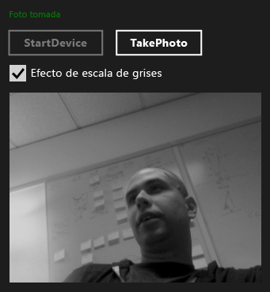

# Tutorial: Crear una aplicaci&#243;n de la Tienda Windows mediante WRL y Media Foundation
[!INCLUDE[vs2017banner](../assembler/inline/includes/vs2017banner.md)]

Aprenda a usar el [!INCLUDE[cppwrl](../windows/includes/cppwrl_md.md)] ([!INCLUDE[cppwrl_short](../windows/includes/cppwrl_short_md.md)]) para crear un [!INCLUDE[win8_appname_long](../build/includes/win8_appname_long_md.md)] aplicación que utiliza [Microsoft Media Foundation](http://msdn.microsoft.com/library/windows/apps/ms694197).  
  
 Este ejemplo crea una transformación personalizada de Media Foundation que aplica un efecto de escala de grises a las imágenes capturadas con una cámara web. La aplicación utiliza C++ para definir la transformación personalizada y C# para usar el componente para transformar las imágenes capturadas.  
  
> [!NOTE]
>  En lugar de C#, también puede usar JavaScript, Visual Basic o C++ para utilizar el componente de transformación personalizado.  
  
 En la mayoría de los casos, puede usar [!INCLUDE[cppwrt](../build/reference/includes/cppwrt_md.md)] ([!INCLUDE[cppwrt_short](../build/reference/includes/cppwrt_short_md.md)]) para crear componentes de [!INCLUDE[wrt](../atl/reference/includes/wrt_md.md)]. (Para obtener más información, consulte [Referencia del lenguaje de Visual C++](../Topic/Visual%20C++%20Language%20Reference%20\(C++-CX\).md).) Sin embargo, a veces es necesario usar [!INCLUDE[cppwrl_short](../windows/includes/cppwrl_short_md.md)]. Por ejemplo, al crear una extensión de medios para Microsoft Media Foundation, tiene que crear un componente que implemente tanto interfaces COM como de [!INCLUDE[wrt](../atl/reference/includes/wrt_md.md)]. Dado que [!INCLUDE[cppwrt_short](../build/reference/includes/cppwrt_short_md.md)] solo puede crear objetos de [!INCLUDE[wrt](../atl/reference/includes/wrt_md.md)], para crear una extensión de medios tiene que utilizar [!INCLUDE[cppwrl_short](../windows/includes/cppwrl_short_md.md)], porque permite la implementación de interfaces COM y de [!INCLUDE[wrt](../atl/reference/includes/wrt_md.md)].  
  
> [!NOTE]
>  Aunque este ejemplo de código es largo, muestra el mínimo necesario para crear una transformación útil de Media Foundation. Puede utilizarlo como punto de partida para su propia transformación personalizada. Este ejemplo está adaptado de la [ejemplo de extensiones multimedia](http://code.msdn.microsoft.com/windowsapps/Media-extensions-sample-7b466096), qué extensiones de media usa para aplicar efectos a vídeo, descodificar vídeo y crear controladores de esquema que generan secuencias de multimedia.  
  
## Requisitos previos  
  
-   Experimentar con la [en tiempo de ejecución de Windows](http://msdn.microsoft.com/library/windows/apps/br211377.aspx).  
  
-   Experiencia con COM.  
  
-   Cámara web.  
  
## Puntos clave  
  
-   Para crear un componente personalizado de Media Foundation, utilice un archivo de definición de lenguaje de definición de interfaz de Microsoft (MIDL) para definir una interfaz, implemente esa interfaz y, a continuación, haga que se pueda activar desde otros componentes.  
  
-   El `namespace` y `runtimeclass` atributos y el `NTDDI_WIN8`[versión](http://msdn.microsoft.com/es-es/66ac5cf3-2230-44fd-aaf6-8013e4a4ae81) valor de atributo son componentes importantes de la definición de MIDL para un componente de Media Foundation usa [!INCLUDE[cppwrl_short](../windows/includes/cppwrl_short_md.md)].  
  
-   [Microsoft::WRL::RuntimeClass](../windows/runtimeclass-class.md) es la clase base para el componente personalizado de Media Foundation. El [Microsoft::WRL::RuntimeClassType::WinRtClassicComMix](../windows/runtimeclasstype-enumeration.md) valor de enumeración, que se proporciona como un argumento de plantilla, marca la clase para su uso como un [!INCLUDE[wrt](../atl/reference/includes/wrt_md.md)] clase y como una clase en tiempo de ejecución de COM clásica.  
  
-   El [InspectableClass](../windows/inspectableclass-macro.md) macro implementa la funcionalidad básica de COM como recuento de referencias y `QueryInterface` método y establece el tiempo de ejecución, nombre de clase y nivel de confianza.  
  
-   Utilice el Microsoft:: wrl::[Module (clase)](https://www.microsoftonedoc.com/#/organizations/e6f6a65cf14f462597b64ac058dbe1d0/projects/3fedad16-eaf1-41a6-8f96-0c1949c68f32/containers/a3daf831-1c5f-4bbe-964d-503870caf874/tocpaths/b4acf5de-2f4c-4c8b-b5ff-9140d023ecbe/locales/en-US) para implementar funciones de punto de entrada DLL como [DllGetActivationFactory](http://msdn.microsoft.com/library/br205771.aspx), [DllCanUnloadNow](http://msdn.microsoft.com/library/windows/desktop/ms690368\(v=vs.85\).aspx), y [DllGetClassObject](http://msdn.microsoft.com/library/windows/desktop/ms680760\(v=vs.85\).aspx).  
  
-   Vincule la DLL del componente a runtimeobject.lib. Especificar [/WINMD](../Topic/Compiler%20and%20Linker%20options%20\(C++-CX\).md) en la línea del vinculador para generar los metadatos de Windows.  
  
-   Use referencias de proyecto para hacer los componentes de [!INCLUDE[cppwrl_short](../windows/includes/cppwrl_short_md.md)] accesibles a las aplicaciones de [!INCLUDE[win8_appname_long](../build/includes/win8_appname_long_md.md)].  
  
### Para usar [!INCLUDE[cppwrl_short](../windows/includes/cppwrl_short_md.md)] para crear el componente de transformación de escala de grises de Media Foundation  
  
1.  En Visual Studio, cree un **solución en blanco** proyecto. Nombre del proyecto, por ejemplo, `MediaCapture`.  
  
2.  Agregar un **DLL (aplicaciones de tienda Windows)** proyecto a la solución. Nombre del proyecto, por ejemplo, `GrayscaleTransform`.  
  
3.  Agregar un **Archivo Midl (.idl)** archivo al proyecto. Nombre del archivo, por ejemplo, `GrayscaleTransform.idl`.  
  
4.  Agregue este código a GrayscaleTransform.idl.  
  
     [!code-cpp[wrl-media-capture#1](../windows/codesnippet/CPP/walkthrough-creating-a-windows-store-app-using-wrl-and-media-foundation_1.idl)]  
  
5.  Utilice el código siguiente para reemplazar el contenido de pch.h.  
  
     [!code-cpp[wrl-media-capture#2](../windows/codesnippet/CPP/walkthrough-creating-a-windows-store-app-using-wrl-and-media-foundation_2.h)]  
  
6.  Agregue un nuevo archivo de encabezado al proyecto, asígnele el nombre `BufferLock.h`, y, a continuación, agregue este código:  
  
     [!code-cpp[wrl-media-capture#3](../windows/codesnippet/CPP/walkthrough-creating-a-windows-store-app-using-wrl-and-media-foundation_3.h)]  
  
7.  GrayscaleTransform.h no se utiliza en este ejemplo. Puede quitarlo del proyecto si lo desea.  
  
8.  Utilice el código siguiente para reemplazar el contenido de GrayscaleTransform.cpp.  
  
     [!code-cpp[wrl-media-capture#4](../windows/codesnippet/CPP/walkthrough-creating-a-windows-store-app-using-wrl-and-media-foundation_4.cpp)]  
  
9. Agregue un nuevo archivo de definición de módulo al proyecto, asígnele el nombre `GrayscaleTransform.def`, y, a continuación, agregue este código:  
  
     [!CODE [wrl-media-capture#5](../CodeSnippet/VS_Snippets_Misc/wrl-media-capture#5)]  
  
10. Utilice el código siguiente para reemplazar el contenido de dllmain.cpp.  
  
     [!code-cpp[wrl-media-capture#6](../windows/codesnippet/CPP/walkthrough-creating-a-windows-store-app-using-wrl-and-media-foundation_6.cpp)]  
  
11. En el proyecto **páginas de propiedades** cuadro de diálogo, configure lo siguiente **vinculador** Propiedades.  
  
    1.  Bajo **entrada**, para el **el archivo de definición de módulo**, especifique `GrayScaleTransform.def`.  
  
    2.  También en **entrada**, agregar `runtimeobject.lib`, `mfuuid.lib`, y `mfplatf.lib` a la **dependencias adicionales** propiedad.  
  
    3.  Bajo **metadatos de Windows**, establezca **generar metadatos de Windows** a **Sí (/ WINMD)**.  
  
### Para usar el componente personalizado de Media Foundation de [!INCLUDE[cppwrl_short](../windows/includes/cppwrl_short_md.md)] desde una aplicación de C#  
  
1.  Agregue un nuevo **C# aplicación vacía (XAML)** proyecto a la `MediaCapture` solución. Nombre del proyecto, por ejemplo, `MediaCapture`.  
  
2.  En el **mediacapture que** del proyecto, agregue una referencia a la `GrayscaleTransform` proyecto. Para obtener información sobre cómo hacerlo, vea [Cómo: agregar o quitar referencias utilizando el Administrador de referencias](../Topic/How%20to:%20Add%20or%20Remove%20References%20By%20Using%20the%20Reference%20Manager.md).  
  
3.  En Package.appxmanifest, en la **capacidades** ficha, seleccione **micrófono** y **Webcam**. Ambas capacidades son necesarias para capturar fotografías con la cámara web.  
  
4.  En MainPage.xaml, agregue este código a la raíz [cuadrícula](http://msdn.microsoft.com/library/windows/apps/xaml/windows.ui.xaml.controls.grid.aspx) elemento:  
  
     [!code-xml[wrl-media-capture#7](../windows/codesnippet/Xaml/walkthrough-creating-a-windows-store-app-using-wrl-and-media-foundation_7.xaml)]  
  
5.  Utilice el código siguiente para reemplazar el contenido de MainPage.xaml.cs.  
  
     [!code-cs[wrl-media-capture#8](../windows/codesnippet/CSharp/walkthrough-creating-a-windows-store-app-using-wrl-and-media-foundation_8.cs)]  
  
 En la siguiente ilustración se muestra la aplicación MediaCapture.  
  
   
  
## Pasos siguientes  
 En el ejemplo se muestra cómo capturar fotografías con la cámara web predeterminada de una en una. El [ejemplo de extensiones multimedia](http://code.msdn.microsoft.com/windowsapps/Media-extensions-sample-7b466096) hace más. Muestra cómo enumerar los dispositivos de cámara web y trabajar con controladores de esquema locales, además de mostrar los efectos de medios adicionales que funcionan en fotos individuales y secuencias de vídeo.  
  
## Vea también  
 [Biblioteca de plantillas C++ de Windows en tiempo de ejecución (WRL)](../Topic/Windows%20Runtime%20C++%20Template%20Library%20\(WRL\).md)   
 [Microsoft Media Foundation](http://msdn.microsoft.com/library/windows/apps/ms694197)   
 [Ejemplo de extensiones de medios](http://code.msdn.microsoft.com/windowsapps/Media-extensions-sample-7b466096)